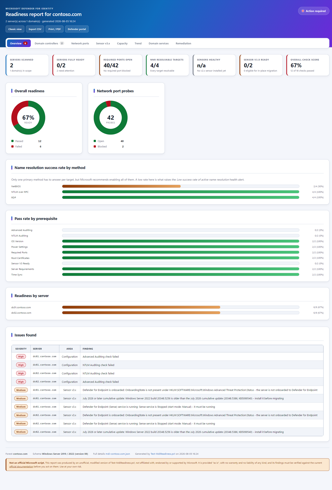
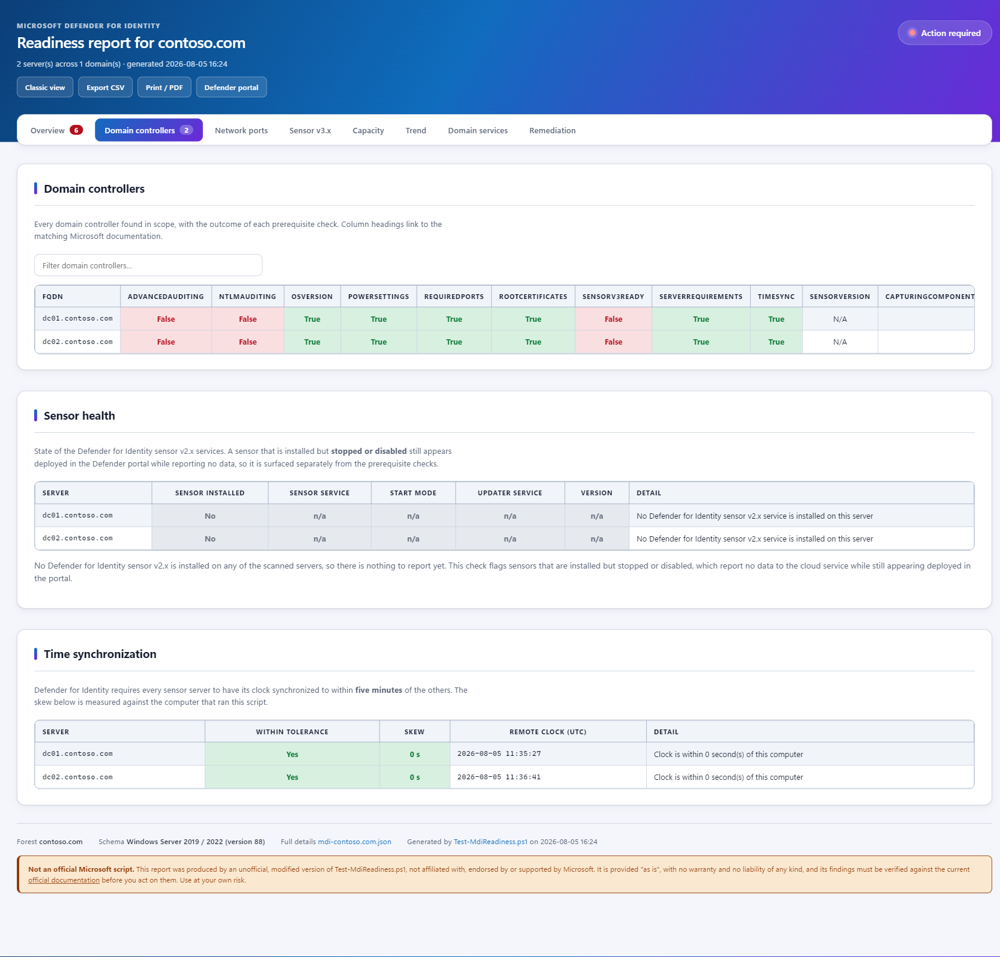
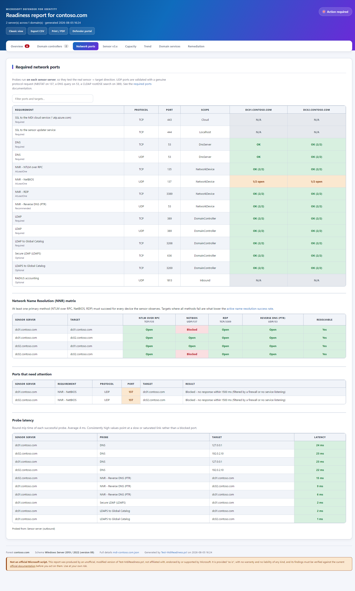
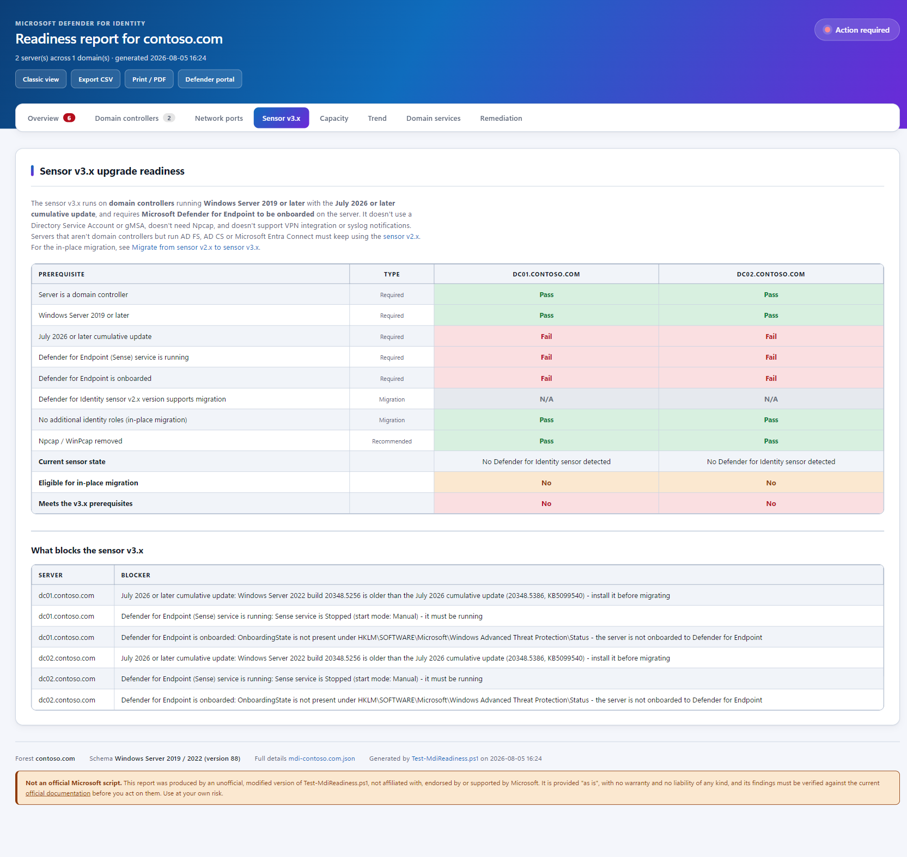
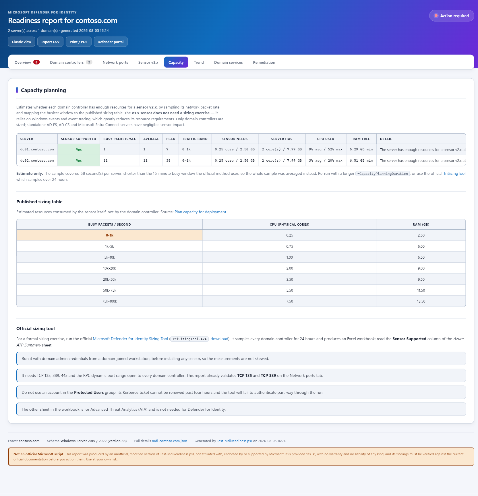
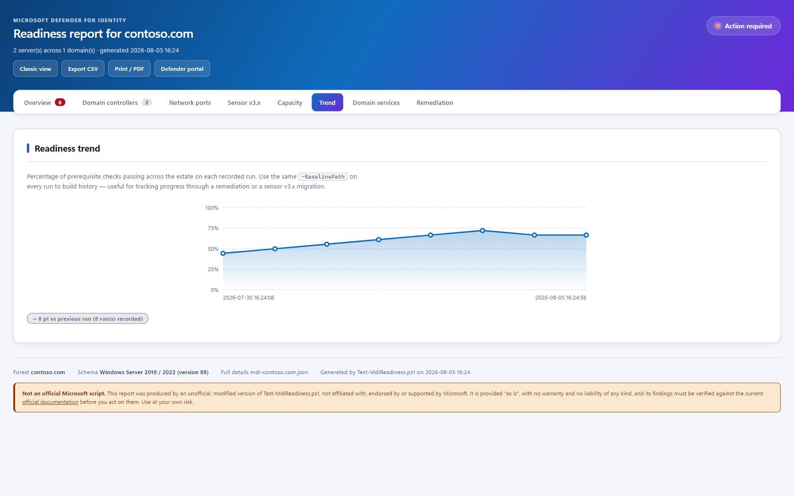
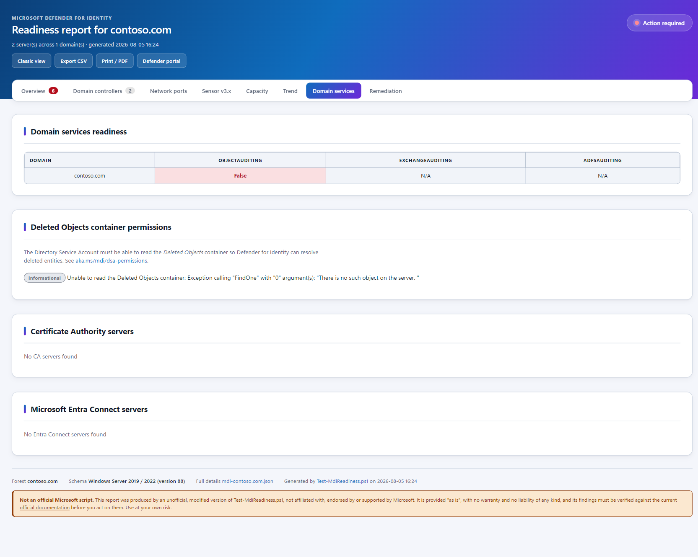
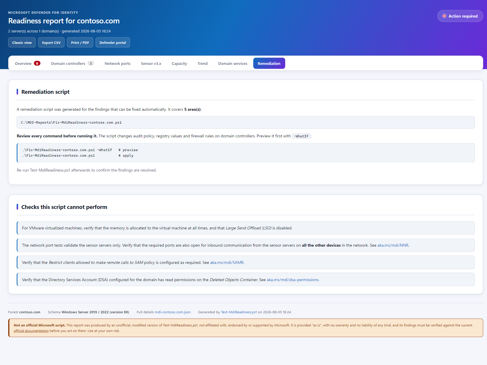
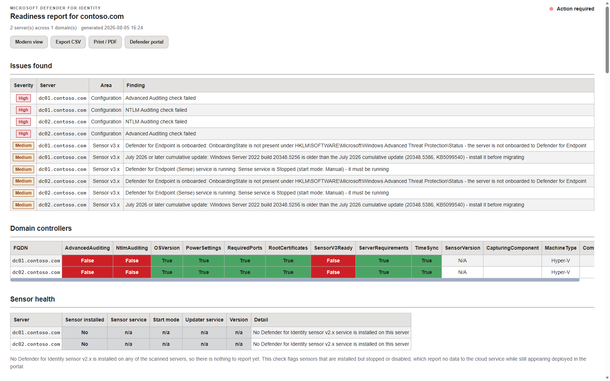

# Test-MdiReadiness.ps1

> ## ⚠️ THIS IS NOT AN OFFICIAL MICROSOFT SCRIPT
>
> This is an **unofficial, modified version** of the
> [Test-MdiReadiness.ps1](https://github.com/microsoft/Microsoft-Defender-for-Identity/tree/main/Test-MdiReadiness)
> script originally published by Microsoft.
>
> **It is not affiliated with, endorsed by, approved by, or supported by Microsoft in any way.**
> Microsoft provides no support for it — do not open Microsoft support cases about this version.
> For the official, supported tool, use the
> [original script](https://github.com/microsoft/Microsoft-Defender-for-Identity).
>
> ### No warranty and no liability
>
> This script is provided **"AS IS"** and **"WITH ALL FAULTS"**, without warranty of any kind, either
> express or implied, including without limitation any warranties of merchantability, fitness for a
> particular purpose, accuracy, or non-infringement.
>
> **No responsibility and no liability is accepted whatsoever** if this script does not work,
> produces incorrect or incomplete results, or causes any problem of any kind — including, without
> limitation, service interruption, downtime, misconfiguration, loss of data, loss of profits, or any
> direct, indirect, incidental, special, consequential or punitive damages, even if advised of the
> possibility of such damage.
>
> **You use it entirely at your own risk.** The entire risk as to the results, performance and
> consequences of using this script rests with you. You are solely responsible for validating its
> behaviour and its output before relying on either.
>
> ### Before you run it
>
> - It **reads configuration from your domain controllers** and other servers, and opens network
>   connections to them. Some checks require elevated privileges and remote WMI access.
> - **Review the code, and test it in a non-production environment first.**
> - The optional `-RemediationScript` switch **generates** a script that would change audit policy,
>   registry values and firewall rules on domain controllers. Nothing is ever applied automatically —
>   review the generated script and run it with `-WhatIf` before applying anything.
> - Checks reflect Microsoft's published documentation at the time of writing and **may become
>   outdated**. Always verify against the current
>   [official documentation](https://learn.microsoft.com/defender-for-identity/).
>
> Original work Copyright (c) Microsoft Corporation, used under the terms of the upstream repository's
> [MIT licence](https://github.com/microsoft/Microsoft-Defender-for-Identity/blob/main/LICENSE).

The Test-MdiReadiness.ps1 script will query your domain, domain controllers and CA servers to report if the different **Microsoft Defender for Identity** prerequisites are in place or not. It creates an html report and a detailed json file with all the collected data.

It will check the domain for the following items:

- [Object Auditing](https://aka.ms/mdi/objectauditing)
- [Exchange Auditing](https://aka.ms/mdi/exchangeauditing)
- [ADFS Auditing](https://aka.ms/mdi/adfsauditing)

It will test the domain controllers for the following items:

- [Advanced Audit Policy Configuration](https://aka.ms/mdi/advancedauditing)
- [NTLM Auditing](https://aka.ms/mdi/ntlmauditing)
- [Power scheme is set to *high performance*](https://aka.ms/mdi/powersettings)
- [Root certificates are updated](https://aka.ms/mdi/rootcertificates)
- [Required network ports](https://learn.microsoft.com/defender-for-identity/deploy/prerequisites-sensor-version-2#required-ports)
- [Sensor v3.x upgrade readiness](https://learn.microsoft.com/defender-for-identity/deploy/deploy-sensor-v3)

It will test the CA servers for the following items:

- [Advanced Audit Policy Configuration for CA servers](https://aka.ms/mdi/advancedauditingca)
- [CA Auditing](https://aka.ms/mdi/caauditing)
- [Power scheme is set to *high performance*](https://aka.ms/mdi/powersettings)
- [Root certificates are updated](https://aka.ms/mdi/rootcertificates)
- [Required network ports](https://learn.microsoft.com/defender-for-identity/deploy/prerequisites-sensor-version-2#required-ports)

It will test the Entra Connect servers for the following items:

- [Advanced Audit Policy Configuration for Entra Connect servers](https://learn.microsoft.com/defender-for-identity/deploy/configure-windows-event-collection#configure-auditing-on-microsoft-entra-connect)
- [Power scheme is set to *high performance*](https://aka.ms/mdi/powersettings)
- [Required network ports](https://learn.microsoft.com/defender-for-identity/deploy/prerequisites-sensor-version-2#required-ports)

## Forest-wide scanning

Use `-Forest` to enumerate and test **every domain controller of every domain in the forest** in a single run, and
produce one consolidated report. Run it from a workstation or member server with an account that has read permissions
in all the domains of the forest (typically an Enterprise Admin):

```powershell
.\Test-MdiReadiness.ps1 -Forest -OpenHtmlReport -Verbose
```

## Required network ports

The script validates the network ports documented in the
[sensor prerequisites](https://learn.microsoft.com/defender-for-identity/deploy/prerequisites-sensor-version-2#required-ports)
and in the [Network Name Resolution](https://learn.microsoft.com/defender-for-identity/nnr-policy) article.

The probes are executed **on each sensor server**, so they test the real *sensor → target* direction rather than the
reverse. If a server can't be reached over WMI, the script falls back to probing that server from the machine running
the script and says so in the report.

| Requirement | Protocol | Port | Tested against |
|---|---|---|---|
| SSL to the MDI cloud service (`*.atp.azure.com`) | TCP | 443 | `https://<workspace>sensorapi.atp.azure.com` (needs `-WorkspaceName`) |
| SSL to the sensor updater service | TCP | 444 | localhost |
| DNS | TCP and UDP | 53 | the DNS servers configured on the sensor |
| NNR - NTLM over RPC | TCP | 135 | domain controllers and any `-NnrTargetComputer` |
| NNR - NetBIOS | UDP | 137 | domain controllers and any `-NnrTargetComputer` |
| NNR - RDP | TCP | 3389 | domain controllers and any `-NnrTargetComputer` |
| NNR - Reverse DNS (PTR) | UDP | 53 | domain controllers and any `-NnrTargetComputer` |
| LDAP | TCP and UDP | 389 | domain controllers |
| LDAP to Global Catalog | TCP | 3268 | domain controllers |
| Secure LDAP (LDAPS) | TCP | 636 | domain controllers (required with `-MultiForest`) |
| LDAPS to Global Catalog | TCP | 3269 | domain controllers (required with `-MultiForest`) |
| RADIUS accounting | UDP | 1813 | the sensor itself (needs `-TestVpnRadius`) |

UDP ports are validated with a real protocol request (an NBSTAT node status request on 137, a DNS query on 53 and a
CLDAP rootDSE search on 389), because a UDP "connect" alone proves nothing.

### Troubleshooting *Low success rate of active name resolution*

That sensor health alert means the sensor can't resolve observed IP addresses to device names using the four NNR
methods. The report contains a dedicated **Network Name Resolution (NNR) matrix** showing, per sensor and per target,
which of the four methods succeeded and whether the target is resolvable at all. Point the script at a representative
sample of the endpoints in your environment, not just the domain controllers:

```powershell
.\Test-MdiReadiness.ps1 -Forest -NnrTargetComputer 'WKS001','WKS002','SRV042' -WorkspaceName 'contoso-corp' -OpenHtmlReport
```

Only one primary method (135 / 137 / 3389) has to succeed per target, but Microsoft recommends opening all of them.
Note that the ports must be open **for inbound communication from the sensors on every computer in the environment** —
the script can only sample the targets you give it.

## Sensor v3.x upgrade readiness

The report includes a **Sensor v3.x upgrade readiness** section that checks the
[v3.x prerequisites](https://learn.microsoft.com/defender-for-identity/deploy/deploy-sensor-v3) and the
[in-place migration prerequisites](https://learn.microsoft.com/defender-for-identity/deploy/migrate-to-sensor-v3) on
every server:

| Check | Requirement |
|---|---|
| Server is a domain controller | v3.x supports domain controllers only. Standalone AD FS / AD CS / Entra Connect servers must keep the v2.x sensor |
| Windows Server 2019 or later | Windows Server 2016 and earlier require the v2.x sensor |
| July 2026 or later cumulative update | Compares the OS build revision against the July 2026 update of that Windows Server release |
| Defender for Endpoint (Sense) service is running | `Sense` service state |
| Defender for Endpoint is onboarded | `HKLM\SOFTWARE\Microsoft\Windows Advanced Threat Protection\Status\OnboardingState` = `1`. Endpoint-only deployment isn't sufficient |
| Sensor v2.x version supports migration | The in-place migration needs sensor v2.x `2.254.19112.470` or later |
| No additional identity roles | DCs also running AD FS, AD CS or Entra Connect support v3.x for new deployments but not the in-place migration workflow |
| Npcap / WinPcap removed | Npcap was used by the v2.x sensor and isn't required by v3.x |

Use `-SkipSensorV3Readiness` to skip these checks.

## Capacity planning

`-CapacityPlanning` estimates whether each domain controller has enough resources for a **sensor v2.x**. It samples
the packet rate of every domain controller over remote WMI, maps the busiest window to the
[published sizing table](https://learn.microsoft.com/defender-for-identity/deploy/capacity-planning), and reports the
same verdicts the official tool uses (`Yes`, `Yes, but additional resources required`, `Maybe`, `No`):

```powershell
.\Test-MdiReadiness.ps1 -Forest -CapacityPlanning
.\Test-MdiReadiness.ps1 -Forest -CapacityPlanning -CapacityPlanningDuration 3600   # longer sample
```

| Busy packets / second | CPU (physical cores) | RAM (GB) |
|---|---|---|
| 0-1k | 0.25 | 2.50 |
| 1k-5k | 0.75 | 6.00 |
| 5k-10k | 1.00 | 6.50 |
| 10k-20k | 2.00 | 9.00 |
| 20k-50k | 3.50 | 9.50 |
| 50k-75k | 5.50 | 11.50 |
| 75k-100k | 7.50 | 13.50 |

Only domain controllers are sized — standalone AD FS, AD CS and Entra Connect servers have negligible sensor impact.
The report also records CPU and memory utilization, and flags hyper-threading, since the published figures exclude
hyper-threaded cores.

> **This is an approximation, not a replacement.** For a formal sizing exercise run the official
> [Microsoft Defender for Identity Sizing Tool](https://github.com/microsoft/Microsoft-Defender-for-Identity-Sizing-Tool)
> (`TriSizingTool.exe`, [download](https://aka.ms/mdi/sizingtool)), which samples every domain controller for **24 hours**
> and produces an Excel workbook. Run it with domain admin credentials from a domain-joined workstation, before
> installing any sensor, and not with an account in the **Protected Users** group.
>
> The **sensor v3.x does not need a sizing exercise** — it relies on Windows events and event tracing.

## Remediation script

`-RemediationScript` writes a `Fix-MdiReadiness-<domain>.ps1` next to the reports containing the commands that fix the
findings that can be fixed automatically:

| Finding | Generated remediation |
|---|---|
| Advanced audit policy | `auditpol.exe /set /subcategory:{GUID}` per required subcategory |
| NTLM auditing | `New-ItemProperty` for each required registry value |
| Power scheme | `powercfg.exe /setactive` for the High performance scheme |
| Blocked NNR ports | `New-NetFirewallRule` on the failing targets, scoped to the sensor IPs only |
| Stopped sensor services | `Set-Service` / `Start-Service` for `AATPSensor` and `AATPSensorUpdater` |
| Clock skew | `w32tm.exe /resync /force` |
| Deleted Objects permissions | `dsacls.exe` granting `LCRP` to the DSA |
| Sensor v3.x blockers | Documented as comments — these need manual action (MDE onboarding, cumulative update) |

The generated script supports `-WhatIf`. **Always review it before running it** — it changes audit policy, registry
values and firewall rules on domain controllers.

```powershell
.\Test-MdiReadiness.ps1 -Forest -RemediationScript
.\Fix-MdiReadiness-contoso.com.ps1 -WhatIf     # preview
.\Fix-MdiReadiness-contoso.com.ps1             # apply
```

## Trend tracking

`-BaselinePath` records each run in a compact history file and charts how readiness evolves over time in the
**Trend** tab. Use the same path on every run:

```powershell
.\Test-MdiReadiness.ps1 -Forest -BaselinePath 'C:\MDI\history'
```

## Running as a scheduled compliance gate

`-FailOnIssues` exits with a non-zero exit code (the number of failed checks, capped at 254) so the script can gate a
pipeline, and `-AsJson` emits the full report object instead of the boolean result:

```powershell
.\Test-MdiReadiness.ps1 -Forest -FailOnIssues
if ($LASTEXITCODE -ne 0) { throw "MDI readiness regressed" }

.\Test-MdiReadiness.ps1 -Forest -AsJson | ConvertFrom-Json
```

## Additional checks

| Check | What it validates |
|---|---|
| Sensor health | `AATPSensor` and `AATPSensorUpdater` service state and start mode — an installed but stopped sensor reports no data |
| Time synchronization | Sensor servers must be within five minutes of each other (`-MaxClockSkewMinutes` to change the tolerance) |
| Deleted Objects permissions | The DSA must have read access to the Deleted Objects container (`-DirectoryServiceAccount` to assert a specific account) |
| Probe latency | Round-trip time of each successful port probe, to separate *blocked* from *reachable but slow* |

## The HTML report

The report is a **single self-contained HTML file** with no external dependencies, so it renders identically on an
isolated domain controller with no internet access.

### Overview

A dashboard of KPI cards and SVG charts: overall readiness, port probe results, name resolution success rate per
method, pass rate per prerequisite and readiness per server. Below it, a consolidated **Issues found** table that
merges failed checks, blocked ports, unresolvable NNR targets and sensor v3.x blockers, sorted by severity.



### Domain controllers

Every domain controller in scope with the outcome of each prerequisite check, plus sensor service health and clock
skew. Column headings link to the matching Microsoft documentation.



### Network ports

The port matrix, the **Network Name Resolution matrix** used to troubleshoot the *Low success rate of active name
resolution* health alert, the list of ports that need attention, and probe latency.



### Sensor v3.x

Per-server verdict on the sensor v3.x prerequisites and in-place migration eligibility, with the exact blocker for
each server.



### Capacity

Estimated sensor v2.x resource requirements based on the measured packet rate, alongside the published sizing table
and guidance for the official sizing tool.



### Trend

Readiness across runs when `-BaselinePath` is used, so progress through a remediation or migration is visible.



### Domain services

Domain-wide auditing, Deleted Objects container permissions, and any CA or Microsoft Entra Connect servers found.



### Remediation

The generated remediation script, and the checks that cannot be performed automatically.



### Classic view

One click returns the original single-page layout, for anyone who prefers the report they already know. The data is
identical — only the presentation changes.



Other report features:

- **clickable tabs** per area, each deep-linkable (for example `mdi-contoso.com.html#tab-ports`) and filterable with a
  free-text search box
- **Export CSV** of the active tab
- a responsive layout that adapts from ultrawide down to phone width, and a print stylesheet that expands every tab
  and preserves all colours so *Print / PDF* produces a complete, colour-accurate document

> The screenshots above were produced from an anonymized sample report. Host names, domain names and IP addresses are
> replaced with documentation values (`contoso.com`, RFC 5737 `192.0.2.0/24`).

```txt
NAME
    .\Test-MdiReadiness.ps1

SYNOPSIS
    Verifies Microsoft Defender for Identity prerequisites are in place

DESCRIPTION
    This script will query your domain and report if the different Microsoft Defender for Identity prerequisites are in place. It creates an html report and a detailed json file with all the collected data.

SYNTAX
    .\Test-MdiReadiness.ps1 [[-Path] <String>] [[-Domain] <String>] [-Forest] [[-DomainController] <String[]>] [[-CAServer] <String[]>] [-SkipNetworkPorts] [-SkipSensorV3Readiness] [[-WorkspaceName] <String>] [[-NnrTargetComputer] <String[]>] [-MultiForest] [-TestVpnRadius] [-OpenHtmlReport] [-WhatIf] [-Confirm] [<CommonParameters>]

    .\Test-MdiReadiness.ps1 [[-Path] <String>] [[-Domain] <String>] [-Forest] [[-DomainController] <String[]>] [-SkipCA] [-OpenHtmlReport] [-WhatIf] [-Confirm] [<CommonParameters>]

PARAMETERS
    -Path <String>
        Path to a folder where the reports are be saved. Defaults to the current folder.

        Required?                    false
        Position?                    1
        Default value                .
        Accept pipeline input?       false
        Accept wildcard characters?  false

    -Domain <String>
        Domain Name or FQDN to work against. Defaults to the current domain.

        Required?                    false
        Position?                    2
        Default value
        Accept pipeline input?       false
        Accept wildcard characters?  false

    -Forest [<SwitchParameter>]
        Scan every domain in the Active Directory forest instead of a single domain. Requires an account with read
        permissions in all domains of the forest (typically Enterprise Admin).

        Required?                    false
        Position?                    named
        Default value                False
        Accept pipeline input?       false
        Accept wildcard characters?  false

    -SkipNetworkPorts [<SwitchParameter>]
        Skip the Microsoft Defender for Identity required network port tests.

        Required?                    false
        Position?                    named
        Default value                False
        Accept pipeline input?       false
        Accept wildcard characters?  false

    -SkipSensorV3Readiness [<SwitchParameter>]
        Skip the Defender for Identity sensor v3.x upgrade readiness tests.

        Required?                    false
        Position?                    named
        Default value                False
        Accept pipeline input?       false
        Accept wildcard characters?  false

    -WorkspaceName <String>
        The Defender for Identity workspace name, used to test outbound HTTPS connectivity to
        https://<WorkspaceName>sensorapi.atp.azure.com. Shown in the Microsoft Defender portal under
        Settings > Identities > About.

        Required?                    false
        Position?                    named
        Default value
        Accept pipeline input?       false
        Accept wildcard characters?  false

    -NnrTargetComputer <String[]>
        Additional computer(s) that each sensor should be able to reach using the Network Name Resolution protocols.
        Use this to validate NNR against a representative sample of the endpoints in your environment.

        Required?                    false
        Position?                    named
        Default value
        Accept pipeline input?       false
        Accept wildcard characters?  false

    -MaxNnrTargets <Int32>
        Maximum number of peer domain controllers probed for NNR from each sensor. Defaults to 5, 0 means all.

        Required?                    false
        Position?                    named
        Default value                5
        Accept pipeline input?       false
        Accept wildcard characters?  false

    -MaxLdapTargetsPerDomain <Int32>
        Maximum number of domain controllers per domain used as LDAP probe targets. Defaults to 2, 0 means all.

        Required?                    false
        Position?                    named
        Default value                2
        Accept pipeline input?       false
        Accept wildcard characters?  false

    -PortProbeTimeoutMs <Int32>
        Timeout in milliseconds used for each individual port probe. Defaults to 1500.

        Required?                    false
        Position?                    named
        Default value                1500
        Accept pipeline input?       false
        Accept wildcard characters?  false

    -MultiForest [<SwitchParameter>]
        Treat the environment as a multi-forest deployment, making LDAPS (636) and LDAPS to Global Catalog (3269)
        required instead of optional.

        Required?                    false
        Position?                    named
        Default value                False
        Accept pipeline input?       false
        Accept wildcard characters?  false

    -TestVpnRadius [<SwitchParameter>]
        Test that the sensor servers accept inbound RADIUS accounting traffic on UDP 1813. Only relevant when the
        Defender for Identity VPN integration is configured, and only supported by sensor v2.x.

        Required?                    false
        Position?                    named
        Default value                False
        Accept pipeline input?       false
        Accept wildcard characters?  false

    -DomainController <String[]>
        Specific Domain Controller(s) to work against. If not specified, it will query AD for the list of DCs in the domain.

        Required?                    false
        Position?                    3
        Default value
        Accept pipeline input?       false
        Accept wildcard characters?  false

    -CAServer <String[]>
        Specific Certificate Authority server(s) to work against. If not specified, it will query AD for the members of the "Cert Publishers" group.

        Required?                    false
        Position?                    4
        Default value
        Accept pipeline input?       false
        Accept wildcard characters?  false

    -SkipCA [<SwitchParameter>]
        Skip Certificate Authority servers

        Required?                    false
        Position?                    named
        Default value                False
        Accept pipeline input?       false
        Accept wildcard characters?  false

    -EntraConnectServer <String[]>
        Specific Entra Connect server(s) to work against. If not specified, it will query AD for the Entra Connect server(s) in the domain.

        Required?                    false
        Position?                    5
        Default value
        Accept pipeline input?       false
        Accept wildcard characters?  false

    -SkipEntraConnectServer [<SwitchParameter>]
        Skip Certificate Authority servers

        Required?                    false
        Position?                    named
        Default value                False
        Accept pipeline input?       false
        Accept wildcard characters?  false

    -OpenHtmlReport [<SwitchParameter>]
        Open the HTML report at the end of the collection process

        Required?                    false
        Position?                    named
        Default value                False
        Accept pipeline input?       false
        Accept wildcard characters?  false

NOTES

        Copyright (c) Microsoft Corporation.  All rights reserved.
        Use of this sample source code is subject to the terms of the Microsoft
        license agreement under which you licensed this sample source code. If
        you did not accept the terms of the license agreement, you are not
        authorized to use this sample source code.
        THE SAMPLE SOURCE CODE IS PROVIDED "AS IS", WITH NO WARRANTIES.

    -------------------------- EXAMPLE 1 --------------------------

    PS C:\>.\Test-MdiReadiness.ps1 -DomainController DC1 -OpenHtmlReport
    False

    -------------------------- EXAMPLE 2 --------------------------

    PS C:\>.\Test-MdiReadiness.ps1 -Forest -WorkspaceName 'contoso-corp' -NnrTargetComputer 'WKS001','SRV042' -OpenHtmlReport

    Scans every domain controller in every domain of the forest, tests outbound HTTPS to
    https://contoso-corpsensorapi.atp.azure.com and validates the Network Name Resolution ports against two
    representative endpoints in addition to the domain controllers. Use this to troubleshoot the
    'Low success rate of active name resolution' sensor health alert.

    -------------------------- EXAMPLE 3 --------------------------

    PS C:\>.\Test-MdiReadiness.ps1 -Verbose
    VERBOSE: Performing the operation "Create MDI related configuration reports" on target "CONTOSO.COM".
    VERBOSE: Searching for Domain Controllers in CONTOSO.COM
    VERBOSE: Found 2 Domain Controller(s)
    VERBOSE: Testing server requirements for DC1.CONTOSO.COM
    VERBOSE: Testing power settings for DC1.CONTOSO.COM
    VERBOSE: Testing advanced auditing for DC1.CONTOSO.COM
    VERBOSE: Testing NTLM auditing for DC1.CONTOSO.COM
    VERBOSE: Testing certificates readiness for DC1.CONTOSO.COM
    VERBOSE: Testing MDI sensor for DC1.CONTOSO.COM
    VERBOSE: Testing capturing component for DC1.CONTOSO.COM
    VERBOSE: Getting virtualization platform for DC1.CONTOSO.COM
    VERBOSE: Getting Operating System for DC1.CONTOSO.COM
    VERBOSE: Testing server requirements for DC2.CONTOSO.COM
    VERBOSE: Testing power settings for DC2.CONTOSO.COM
    VERBOSE: Testing advanced auditing for DC2.CONTOSO.COM
    VERBOSE: Testing NTLM auditing for DC2.CONTOSO.COM
    VERBOSE: Testing certificates readiness for DC2.CONTOSO.COM
    VERBOSE: Testing MDI sensor for DC2.CONTOSO.COM
    VERBOSE: Testing capturing component for DC2.CONTOSO.COM
    VERBOSE: Getting virtualization platform for DC2.CONTOSO.COM
    VERBOSE: Getting Operating System for DC2CONTOSO.COM
    VERBOSE: Searching for CA servers in CONTOSO.COM
    VERBOSE: Found 2 CA server(s)
    VERBOSE: Testing server requirements for CA1.CONTOSO.COM
    VERBOSE: Testing power settings for CA1.CONTOSO.COM
    VERBOSE: Testing advanced auditing for CA1.CONTOSO.COM
    VERBOSE: Testing CA auditing for CA1.CONTOSO.COM
    VERBOSE: Testing certificates readiness for CA1.CONTOSO.COM
    VERBOSE: Testing MDI sensor for CA1.CONTOSO.COM
    VERBOSE: Testing capturing component for CA1.CONTOSO.COM
    VERBOSE: Getting virtualization platform for CA1.CONTOSO.COM
    VERBOSE: Getting Operating System for CA1.CONTOSO.COM
    VERBOSE: Testing server requirements for CA2.CONTOSO.COM
    VERBOSE: Testing power settings for CA2.CONTOSO.COM
    VERBOSE: Testing advanced auditing for CA2.CONTOSO.COM
    VERBOSE: Testing CA auditing for CA2.CONTOSO.COM
    VERBOSE: Testing certificates readiness for CA2.CONTOSO.COM
    VERBOSE: Testing MDI sensor for CA2.CONTOSO.COM
    VERBOSE: Testing capturing component for CA2.CONTOSO.COM
    VERBOSE: Getting virtualization platform for CA2.CONTOSO.COM
    VERBOSE: Getting Operating System for CA2.CONTOSO.COM
    VERBOSE: Getting MDI related ADFS auditing configuration
    VERBOSE: Getting MDI related DS Object auditing configuration
    VERBOSE: Getting MDI related Exchange auditing configuration
    VERBOSE: Getting AD Schema Version
    VERBOSE: Creating detailed json report: .\mdi-CONTOSO.COM.json
    VERBOSE: Creating html report: .\mdi-CONTOSO.COM.html
    False
```
